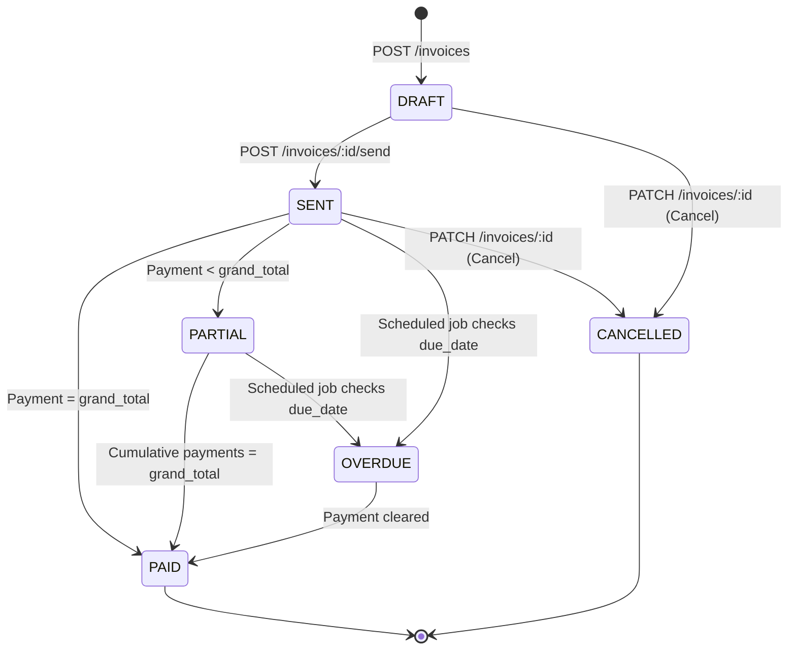
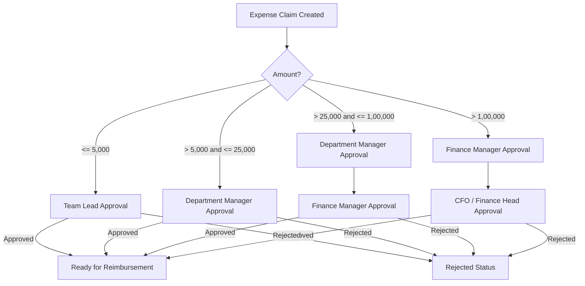
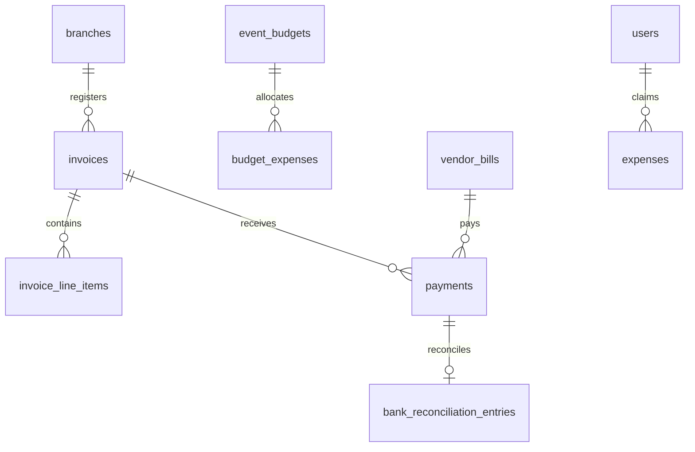
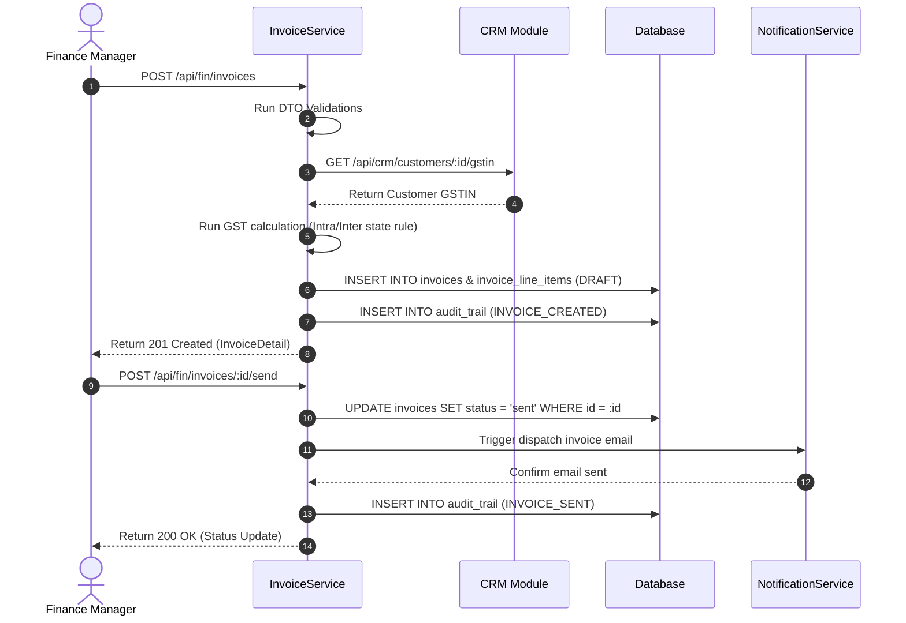
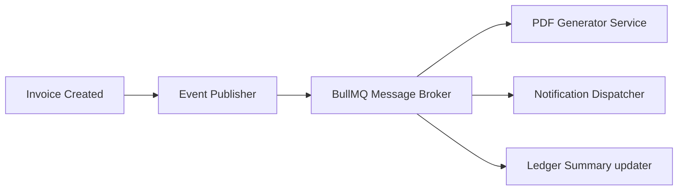
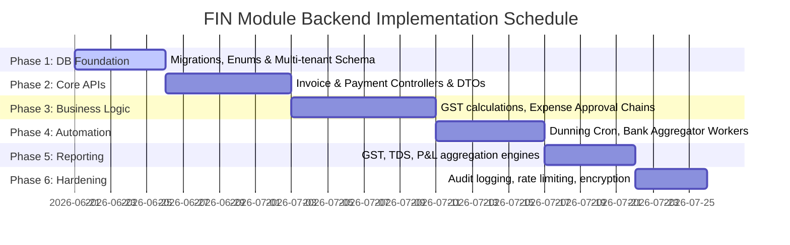

# Finance & Accounting Module (FIN) - Backend Architecture & Implementation Plan

This document serves as the master backend blueprint for the **Finance & Accounting Module (FIN)** of EventHub360. It integrates the client-side screens, workflows, and Zustand stores with the requirements defined in the **FIN Backend Architecture v1.0** document. 

---

## 1. Frontend Findings & Conflict Analysis

### Frontend Findings

#### Screens & Dashboards
*   **Workspace Executive Overview (`src/app/page.tsx`):**
    *   **KPI Widgets:** Total Revenue ($12.4M, +12.5%), Active Events (48, +4), Upcoming Weddings (12), Hotel Occupancy (92%).
    *   **Priorities Progress:** Vendor Contract Review (85%), Venue Walkthrough (20%).
    *   **AI Insights Card:** Recommendation context for bundling events with hotel suites.
    *   **Recent Bookings Table:** Customer, event name, value, status (Confirmed, Pending).
    *   **Booking Mix Donut Chart:** Wedding (45%), Corporate (35%), Hotel Occupancy (20%).
    *   **Revenue Growth Area Chart:** Annualized projected revenue growth trend.
*   **Budget & Ledger Dashboard (`src/app/budget/page.tsx`):**
    *   **KPI Widgets:** Estimated Budget, Actual Spent, Variance Remaining.
    *   **Category Variance Graph:** Recharts bar chart showing Estimated vs Actual by category.
    *   **Ledger Sheets (Table View):** List of expense items showing details, category, estimated cost, actual cost, approval status.
    *   **Approvals Pipeline (Timeline View):** Status tracker for budget sign-off flow: `Pending` -> `Submitted` -> `Approved` -> `Locked`.
*   **Reporting & Analytics Dashboard (`src/app/reporting/page.tsx`):**
    *   **KPI Widgets:** Total Revenue, Total Cost, Gross Profit Margin %, Resource Utilization %.
    *   **Revenue vs Cost Chart:** Side-by-side bar chart of budget projections.
    *   **Resource Category Mix:** Donut chart of Staff vs Equipment vs Venue vs Vehicles.
    *   **Profitability Table:** Detailed table showing Estimated Revenue, Actual Cost, Net Profit, Profit Margin % per event.
    *   **Utilization Table:** Detailed table showing Resource Name, Category, Status, current Assignment, and Utilization Rate %.
    *   **Export Center:** Download action cards for PDF Executive Summary, CSV Ledger, and XLSX Resource Schedulers.

#### Forms & User Actions
*   **Create Event Form (`src/app/events/create/page.tsx`):** Name, category (Corporate, Wedding, Gala), venue, dates, estimated revenue, description.
*   **Add Budget Expense Form (Modal):** Item details name, category (Venue, Catering, Production, Decor, Entertainment, Logistics), estimated cost, actual cost, initial status (Pending, Approved).
*   **Workflow Action triggers:**
    *   "Submit for Review" (Role: Event Manager) -> Sets status to `Submitted`.
    *   "Approve Budget" (Role: Finance Manager) -> Sets status to `Approved`.
    *   "Lock Budget Sheet" (Role: Finance Manager) -> Sets status to `Locked`.
    *   "Approve Expense" (Role: Finance Manager) -> Marks single ledger expense item as `Approved`.

#### Filters, Searches & Pagination
*   **Events List Search & Filter:** Title/venue/owner search, Category dropdown, Status dropdown, Owner dropdown.
*   **Pagination:** Next/Prev pagination on events table (4 items per page).

---

### Conflict & Gap Analysis

1.  **Scope Gap: Corporate FIN vs. Event Budgeting**
    *   *Conflict:* The architecture document specifies high-level corporate functions (Invoices, Credit/Debit Notes, Bank Reconciliation, AR aging, Dunning queues, Vendor bills, Payouts, and Tax reports). The frontend only implements event-level budgeting and ledger expenses.
    *   *Resolution:* The backend database will map **Event Budgets** as distinct sub-ledgers. An event budget will be a collection of estimated and actual expenses. Actual expenses will be linked directly to **Vendor Bills** or **Employee Expense Claims** recorded in the corporate FIN modules. Invoices generated for events will automatically write to the event's `estimated_revenue` and update cash health KPIs.
2.  **Role Inconsistencies**
    *   *Conflict:* Frontend uses `Event Manager`, `Finance Manager`, and `Vendor` roles. The architecture document references `finance_manager`, `accounts_head`, `cfo`, `auditor`, and `employee`.
    *   *Resolution:* Implement standard Role-Based Access Control (RBAC) supporting hierarchical roles. Map frontend roles to backend entities:
        *   `Event Manager` maps to backend `employee` (with event-specific write permissions).
        *   `Finance Manager` maps to backend `finance_manager` / `accounts_head`.
        *   `Vendor` maps to backend external users with read-only access to their assigned deliverables.
3.  **Expense Definitions**
    *   *Conflict:* Frontend `BudgetExpense` has a simple status: `Pending | Approved` with a single-click action. The architecture document details a complex Multi-Level Expense Approval Chain depending on Rupees threshold (up to 5k Team Lead; 5k-25k Dept Manager; 25k-100k Finance Manager; >100k CFO) and receipt OCR mismatch triggers.
    *   *Resolution:* Maintain the simple `BudgetExpense` table as an aggregation ledger. Create an `employee_expense_claims` table that models the multi-stage approval workflow. Once a claim is approved, a worker will automatically create or update the corresponding `BudgetExpense` line item in the budget sheet.

---

## 2. API Specification

All APIs are prefixed with `/api/fin`. Standard envelope used for all responses:
```json
{
  "success": true,
  "data": {},
  "message": "Optional message string"
}
```

### Dashboard endpoints

#### `GET /api/fin/dashboard`
*   **Description:** CFO KPI values (revenue, receivables, payables, profit margin, tax liabilities, and cash runway).
*   **Query Params:** `branchId?: UUID` (for branch-level isolation).
*   **Permissions:** `cfo`, `finance_manager`.
*   **Response DTO:**
    ```typescript
    interface CfoKpisResponse {
      totalRevenue: number;
      receivables: number;
      payables: number;
      marginPercent: number;
      taxLiabilities: number;
      cashForecast30Days: number;
    }
    ```

#### `GET /api/fin/dashboard/revenue-trends`
*   **Description:** Monthly revenue vs opex expenses for a financial year.
*   **Query Params:** `year: number`, `branchId?: UUID`.
*   **Permissions:** `cfo`, `finance_manager`.
*   **Response DTO:** `Array<{ month: string; revenue: number; expenses: number }>`

---

### Invoices endpoints

#### `GET /api/fin/invoices`
*   **Description:** Paginated, filtered list of invoices.
*   **Query Params:** `page`, `limit`, `status`, `customerId`, `startDate`, `endDate`, `sortBy`, `sortOrder`.
*   **Permissions:** `finance_manager`.
*   **Response DTO:** `PaginatedResponse<InvoiceSummary>`

#### `POST /api/fin/invoices`
*   **Description:** Create a new invoice in `DRAFT` status.
*   **Request DTO:**
    ```typescript
    interface CreateInvoiceDto {
      customerId: string;
      issueDate: string; // YYYY-MM-DD
      dueDate: string; // YYYY-MM-DD
      lineItems: Array<{
        description: string;
        quantity: number;
        unitPrice: number;
        gstRate: 0 | 5 | 12 | 18 | 28;
      }>;
      paymentMode?: 'upi' | 'bank_transfer' | 'cheque' | 'cash' | 'card';
      notes?: string;
    }
    ```
*   **Response DTO:** `InvoiceDetail` (contains calculated tax, CGST, SGST, IGST per item, and grand total).

#### `POST /api/fin/invoices/:id/send`
*   **Description:** Transition status from `DRAFT` to `SENT`. Dispatches email containing generated PDF to client.
*   **Permissions:** `finance_manager`.
*   **Response DTO:** `{ success: boolean; invoiceId: string; status: 'sent' }`

---

### Payments & Reconciliation endpoints

#### `POST /api/fin/payments`
*   **Description:** Record payment manually against an invoice.
*   **Request DTO:**
    ```typescript
    interface RecordPaymentDto {
      invoiceId: string;
      amount: number;
      paymentMode: 'upi' | 'bank_transfer' | 'cheque' | 'cash' | 'card';
      utrNumber?: string;
      chequeNumber?: string;
      bankName?: string;
      paymentDate: string; // YYYY-MM-DD
      remarks?: string;
    }
    ```
*   **Response DTO:** `PaymentReceiptResponse`

#### `POST /api/fin/reconciliation/:id/match`
*   **Description:** Match a bank entry (UTR) with an invoice.
*   **Request DTO:** `{ invoiceId: string }`
*   **Permissions:** `finance_manager`.

---

### Accounts Payable (AP) & Bills endpoints

#### `POST /api/fin/ap/bills/upload`
*   **Description:** Upload invoice scan from vendor. Backend processes it using OCR and populates values.
*   **Request Format:** `multipart/form-data` (File payload).
*   **Permissions:** `finance_manager`.
*   **Response DTO:** `OcrBillExtractionResult` (Extracted fields: amount, vendor, GSTIN, invoice date).

---

### Expenses (Employee Reimbursements) endpoints

#### `POST /api/fin/expenses`
*   **Description:** Submit a new expense claim.
*   **Request DTO:**
    ```typescript
    interface CreateExpenseClaimDto {
      category: 'food_beverage' | 'logistics' | 'travel' | 'marketing' | 'venue' | 'decor' | 'miscellaneous';
      description: string;
      amount: number;
      receiptUrl?: string;
      submittedDate: string;
    }
    ```
*   **Permissions:** `employee`.

---

### Event Budget endpoints (Frontend Integrations)

#### `GET /api/fin/budgets/:eventId`
*   **Description:** Fetch event budget summaries and ledger expenses.
*   **Permissions:** `finance_manager`, `employee`.
*   **Response DTO:** `{ summary: BudgetSummary; expenses: BudgetExpense[] }`

#### `PATCH /api/fin/budgets/:eventId/status`
*   **Description:** Advance budget stage.
*   **Request DTO:** `{ status: 'Pending' | 'Submitted' | 'Approved' | 'Locked' }`
*   **Permissions:**
    *   Transition to `Submitted` requires role `employee` (Event Manager).
    *   Transition to `Approved` or `Locked` requires role `finance_manager`.

---

## 3. Business Logic Document

### 3.1 GST Calculation Engine
*   **Inputs:** Supplier GSTIN, Customer GSTIN, Line Items (unit price, quantity, tax rate).
*   **Rules:**
    1.  Extract the first 2 digits (State Code) from both GSTINs.
    2.  If State Codes match: Apply **Intra-State GST** (CGST = GST Rate / 2, SGST = GST Rate / 2, IGST = 0).
    3.  If State Codes differ: Apply **Inter-State GST** (IGST = GST Rate, CGST = 0, SGST = 0).
    4.  Tax calculation:
        $$\text{Taxable Value} = \text{Unit Price} \times \text{Quantity}$$
        $$\text{Tax Amount} = \text{Taxable Value} \times \frac{\text{GST Rate}}{100}$$
        $$\text{Line Item Total} = \text{Taxable Value} + \text{Tax Amount}$$

### 3.2 Invoice State Machine

*   *Rules:* Deleted invoices are prohibited. Cancelled invoices trigger automated generation of a matching Credit Note to offset opex ledgers.

### 3.3 Expense Claims Approval Workflow

*   *Receipt Validation Rule:* Receipts are mandatory for claims > Rs 500. S3 hosted file links undergo OCR parsing. If the OCR-extracted total differs from the input value by $> \pm2\%$, the system sets the claim status to `FLAGGED` and raises an audit exception.

---

## 4. Database Mapping



### Schema Definitions

```sql
-- Enums
CREATE TYPE invoice_status AS ENUM ('draft', 'sent', 'partial', 'paid', 'overdue', 'cancelled');
CREATE TYPE payment_mode AS ENUM ('upi', 'bank_transfer', 'cheque', 'cash', 'card');
CREATE TYPE payment_status AS ENUM ('pending', 'processing', 'settled', 'failed', 'refunded');
CREATE TYPE budget_status AS ENUM ('Pending', 'Submitted', 'Approved', 'Locked');
CREATE TYPE bill_status AS ENUM ('pending', 'approved', 'paid', 'overdue');
CREATE TYPE priority_level AS ENUM ('critical', 'high', 'medium', 'low');
CREATE TYPE expense_status AS ENUM ('pending', 'approved', 'rejected', 'reimbursed', 'flagged');

-- 1. Invoices
CREATE TABLE invoices (
    id UUID PRIMARY KEY DEFAULT gen_random_uuid(),
    branch_id UUID NOT NULL,
    invoice_number VARCHAR(20) UNIQUE NOT NULL,
    customer_id UUID NOT NULL,
    status invoice_status NOT NULL DEFAULT 'draft',
    issue_date DATE NOT NULL,
    due_date DATE NOT NULL,
    subtotal DECIMAL(15,2) NOT NULL CHECK (subtotal >= 0),
    total_gst DECIMAL(15,2) NOT NULL CHECK (total_gst >= 0),
    grand_total DECIMAL(15,2) NOT NULL CHECK (grand_total >= 0),
    payment_mode payment_mode,
    notes TEXT,
    created_by UUID NOT NULL,
    created_at TIMESTAMPTZ NOT NULL DEFAULT now(),
    updated_at TIMESTAMPTZ NOT NULL DEFAULT now(),
    deleted_at TIMESTAMPTZ
);
CREATE INDEX idx_invoices_branch ON invoices(branch_id) WHERE deleted_at IS NULL;
CREATE INDEX idx_invoices_status ON invoices(status);

-- 2. Invoice Line Items
CREATE TABLE invoice_line_items (
    id UUID PRIMARY KEY DEFAULT gen_random_uuid(),
    invoice_id UUID NOT NULL REFERENCES invoices(id) ON DELETE CASCADE,
    description VARCHAR(200) NOT NULL,
    quantity DECIMAL(10,2) NOT NULL CHECK (quantity > 0),
    unit_price DECIMAL(15,2) NOT NULL CHECK (unit_price > 0),
    gst_rate SMALLINT NOT NULL CHECK (gst_rate IN (0, 5, 12, 18, 28)),
    gst_amount DECIMAL(15,2) NOT NULL,
    total DECIMAL(15,2) NOT NULL,
    sort_order SMALLINT NOT NULL DEFAULT 0
);

-- 3. Payments
CREATE TABLE payments (
    id UUID PRIMARY KEY DEFAULT gen_random_uuid(),
    payment_number VARCHAR(20) UNIQUE NOT NULL,
    invoice_id UUID REFERENCES invoices(id),
    vendor_bill_id UUID, -- Nullable if customer payment
    amount DECIMAL(15,2) NOT NULL CHECK (amount > 0),
    payment_mode payment_mode NOT NULL,
    utr_number VARCHAR(50) UNIQUE,
    cheque_number VARCHAR(20),
    bank_name VARCHAR(100),
    status payment_status NOT NULL DEFAULT 'pending',
    payment_date DATE NOT NULL,
    remarks TEXT,
    recorded_by UUID NOT NULL,
    created_at TIMESTAMPTZ NOT NULL DEFAULT now(),
    deleted_at TIMESTAMPTZ
);

-- 4. Bank Reconciliation Entries
CREATE TABLE bank_reconciliation_entries (
    id UUID PRIMARY KEY DEFAULT gen_random_uuid(),
    bank_description TEXT NOT NULL,
    utr_number VARCHAR(50) UNIQUE NOT NULL,
    amount DECIMAL(15,2) NOT NULL,
    transaction_date DATE NOT NULL,
    matched_invoice_id UUID REFERENCES invoices(id),
    is_reconciled BOOLEAN NOT NULL DEFAULT false,
    reconciled_by UUID,
    reconciled_at TIMESTAMPTZ,
    confidence_score DECIMAL(5,2) CHECK (confidence_score BETWEEN 0 AND 100)
);

-- 5. Vendor Bills
CREATE TABLE vendor_bills (
    id UUID PRIMARY KEY DEFAULT gen_random_uuid(),
    branch_id UUID NOT NULL,
    bill_number VARCHAR(50) NOT NULL,
    vendor_id UUID NOT NULL,
    amount DECIMAL(15,2) NOT NULL,
    gst_amount DECIMAL(15,2) NOT NULL,
    total_amount DECIMAL(15,2) NOT NULL,
    bill_date DATE NOT NULL,
    due_date DATE NOT NULL,
    status bill_status NOT NULL DEFAULT 'pending',
    priority priority_level NOT NULL DEFAULT 'medium',
    category VARCHAR(100) NOT NULL,
    document_url TEXT,
    created_at TIMESTAMPTZ DEFAULT now(),
    deleted_at TIMESTAMPTZ,
    CONSTRAINT uq_vendor_bill_num UNIQUE (vendor_id, bill_number)
);

-- 6. Event Budget Summaries
CREATE TABLE event_budgets (
    event_id UUID PRIMARY KEY,
    status budget_status NOT NULL DEFAULT 'Pending',
    total_estimated DECIMAL(15,2) NOT NULL DEFAULT 0,
    total_actual DECIMAL(15,2) NOT NULL DEFAULT 0,
    variance DECIMAL(15,2) NOT NULL DEFAULT 0,
    updated_at TIMESTAMPTZ NOT NULL DEFAULT now()
);

-- 7. Budget Expenses (Detailed Ledger)
CREATE TABLE budget_expenses (
    id UUID PRIMARY KEY DEFAULT gen_random_uuid(),
    event_id UUID NOT NULL REFERENCES event_budgets(event_id) ON DELETE CASCADE,
    category VARCHAR(100) NOT NULL,
    item_name VARCHAR(150) NOT NULL,
    estimated_cost DECIMAL(15,2) NOT NULL CHECK (estimated_cost >= 0),
    actual_cost DECIMAL(15,2) NOT NULL CHECK (actual_cost >= 0),
    status VARCHAR(50) NOT NULL,
    date DATE NOT NULL
);

-- 8. Audit Trail
CREATE TABLE audit_trail (
    id UUID PRIMARY KEY DEFAULT gen_random_uuid(),
    timestamp TIMESTAMPTZ NOT NULL DEFAULT now(),
    user_id UUID NOT NULL,
    action VARCHAR(100) NOT NULL,
    entity VARCHAR(50) NOT NULL,
    entity_id UUID NOT NULL,
    description TEXT NOT NULL,
    severity VARCHAR(20) NOT NULL CHECK (severity IN ('info', 'success', 'warning', 'error')),
    ip_address INET,
    metadata JSONB
);
```

#### Multi-Tenant & Branch-Level Security
*   **Branch-Level Data Isolation:** Every primary transactional table (`invoices`, `vendor_bills`, `payments`) contains a `branch_id` foreign key. Query structures apply implicit branch filter clauses dynamically intercepted from the request context's parsed JWT payload array (`branchIds[]`).
*   **Soft Delete Policy:** Soft deletion is implemented by updating the `deleted_at` column. Soft-deleted files are filtered out of all query results by default using repository-level query filters.

---

## 5. Validation Rules

Validation rules are enforced at three distinct boundaries:
1.  **API Entry Point:** Using NestJS built-in `ValidationPipe` with Zod (using NestJS integration wrappers) or `class-validator`.
2.  **Service/Business Logic Layer:** Explicit business rule evaluations throwing custom HTTP exceptions.
3.  **Database Layer:** Column types, constraints, checks, and unique indexes.

### Validation Catalog

| Target Field | Validation Rules | Error Message | Exception Code | Validation Layer |
| :--- | :--- | :--- | :--- | :--- |
| `customerId` | Must be a valid UUID v4 format. | "Invalid customer identifier format" | `VAL_INVALID_UUID` | API (DTO validation) |
| `issueDate` | Cannot exceed 7 days in the future. | "Issue date cannot exceed 7 days from today" | `VAL_INVALID_ISSUE_DATE` | API / Service |
| `dueDate` | Must be greater than or equal to `issueDate` and within 365 days. | "Due date must be after issue date and within 1 year" | `VAL_INVALID_DUE_DATE` | API / Service |
| `lineItems` | Array size must be between 1 and 50. | "Invoice must contain between 1 and 50 items" | `VAL_LINE_ITEMS_LIMIT` | API |
| `lineItems[].quantity` | Numeric value between 0.01 and 99999. Max 2 decimal places. | "Quantity must be between 0.01 and 99999" | `VAL_QTY_OUT_OF_BOUNDS` | API / DB Check |
| `lineItems[].unitPrice` | Numeric value. Minimum 0.01 INR. | "Unit price must be positive and not exceed Rs 99,99,999" | `VAL_PRICE_OUT_OF_BOUNDS` | API / DB Check |
| `lineItems[].gstRate` | Must be member of set: `{0, 5, 12, 18, 28}`. | "Invalid GST rate selection" | `VAL_INVALID_GST_RATE` | API / DB Check |
| `utrNumber` | Alphanumeric. Unique constraint across payments. | "UTR reference code already exists" | `ERR_CONFLICT_UTR` | DB Unique / API |
| `amount` | Value > 0. Cannot exceed current invoice balance. | "Payment amount exceeds outstanding balance" | `ERR_PAYMENT_EXCEEDS_BALANCE` | Service |
| `receiptUrl` | Mandatory if claim is > Rs 500. Must match regex URL structure. | "Valid receipt image link required for expense claims > 500" | `VAL_RECEIPT_REQUIRED` | Service |
| `submittedDate` | Cannot be older than 30 days in the past. | "Expense claims older than 30 days are locked" | `VAL_EXPENSE_CLAIM_STALE` | Service |

---

## 6. Service Flow Diagrams

This section outlines the textual step-by-step backend execution sequences for critical flows.



### 6.1 Payment Recording & Reconciliation Flow
1.  **Actor:** Finance Manager triggers payment recording.
2.  **API Call:** `POST /api/fin/payments` with invoiceId, amount, mode, and optional UTR.
3.  **PaymentService Verification:**
    *   Queries `invoices` where `id = invoiceId`. Verify invoice exists.
    *   Validates status is not `draft`, `paid`, or `cancelled`.
    *   Validates `amount <= (grand_total - sum(all_payments))`.
4.  **Transaction Execution:**
    *   `INSERT INTO payments` table.
    *   Recalculates outstanding balance.
    *   If outstanding balance is `0`: `UPDATE invoices SET status = 'paid'`.
    *   If outstanding balance is `> 0`: `UPDATE invoices SET status = 'partial'`.
5.  **Reconciliation Matching Hook:**
    *   Fires background event `payment.recorded`.
    *   `ReconciliationService` searches `bank_reconciliation_entries` for records where `utr_number = payment.utr_number` or matching `amount` and `transaction_date` within 3 days.
    *   If confidence match score is $> 95\%$:
        *   `UPDATE bank_reconciliation_entries SET is_reconciled = true, matched_invoice_id = invoiceId`.
    *   `AuditTrailService` writes `PAYMENT_RECORDED` metadata entry.
6.  **Response:** Sends a success message containing the updated receipt object to the client.

### 6.2 Dunning Automated Scheduled Flow
1.  **Cron Trigger:** Fires daily at `00:00 IST`.
2.  **Dunning Job Initialization:**
    *   Queries `invoices` where status is in `('sent', 'partial')` and `due_date < current_date`.
    *   Updates selected record statuses to `overdue`.
3.  **Escalation Check:**
    *   Iterates through overdue records, calculating days past due (`current_date - due_date`).
    *   **Case 1: 1 day past due (L1):** Dispatches soft reminder email via email service.
    *   **Case 2: 8 days past due (L2):** Sends follow-up email and SMS. Creates escalation task in CRM.
    *   **Case 3: 22 days past due (L3):** Generates formal demand PDF, uploads to S3, and sends copy to client.
    *   **Case 4: 43 days past due (L4):** Sets flag for legal review. Triggers notification to `finance_head`.
4.  **Audit Logs:** Writes dunning action items to audit trail.

---

## 7. Backend Architecture (NestJS)

To construct this module, we partition our code base into structured domains.

```
src/
├── app.module.ts
└── fin/
    ├── fin.module.ts
    ├── controllers/
    │   ├── dashboard.controller.ts
    │   ├── invoice.controller.ts
    │   ├── payment.controller.ts
    │   ├── reconciliation.controller.ts
    │   ├── ap.controller.ts
    │   ├── expense.controller.ts
    │   └── budget.controller.ts
    ├── services/
    │   ├── dashboard.service.ts
    │   ├── invoice.service.ts
    │   ├── payment.service.ts
    │   ├── reconciliation.service.ts
    │   ├── expense.service.ts
    │   ├── budget.service.ts
    │   └── audit.service.ts
    ├── repositories/
    │   ├── invoice.repository.ts
    │   ├── payment.repository.ts
    │   ├── bill.repository.ts
    │   ├── expense.repository.ts
    │   └── reconciliation.repository.ts
    ├── dto/
    │   ├── invoice.dto.ts
    │   ├── payment.dto.ts
    │   └── expense.dto.ts
    ├── guards/
    │   ├── fin-auth.guard.ts
    │   └── rbac.guard.ts
    └── processors/
        ├── dunning.processor.ts
        └── ocr.processor.ts
```

### Key Components Definition
*   **Controllers:** Implement endpoints and path structures. Handle request transformations and bind guards.
*   **Services:** Implement business logic calculations (GST logic, opex variance metrics, matching heuristics).
*   **Repositories:** Encapsulate raw SQL database logic. Inject branch filters to ensure data isolation.
*   **Guards:** Perform authorization actions. Decrypt JWT tokens, inspect permissions, and block unauthorized requests.
*   **Interceptors:** Bind standard response envelopes and handle global transaction trace logs.

---

## 8. Authentication & Authorization

### JWT Payload Structure
The JWT is decrypted by a shared `AuthGuard`. The payload structure is defined as:
```typescript
interface JwtPayload {
  userId: string;
  email: string;
  role: 'cfo' | 'finance_manager' | 'accounts_head' | 'auditor' | 'employee' | 'vendor';
  branchIds: string[]; // Branch IDs this user is authorized to access
  permissions: string[];
}
```

### RBAC Matrix

| Feature Endpoint | `cfo` | `finance_manager` | `accounts_head` | `auditor` | `employee` |
| :--- | :---: | :---: | :---: | :---: | :---: |
| `GET /api/fin/dashboard` | **Read** | **Read** | **Read** | **Read** | Denied |
| `POST /api/fin/invoices` | Denied | **Write** | Denied | Denied | Denied |
| `POST /api/fin/invoices/:id/send` | Denied | **Write** | Denied | Denied | Denied |
| `POST /api/fin/payments` | Denied | **Write** | **Write** | Denied | Denied |
| `POST /api/fin/ap/payouts/approve` | Denied | **Write** | **Write** | Denied | Denied |
| `POST /api/fin/ap/payouts/disburse` | Denied | Denied | **Write** | Denied | Denied |
| `POST /api/fin/expenses/:id/approve` | **Write** | **Write** | Denied | Denied | Denied |
| `GET /api/fin/reports/audit` | **Read** | **Read** | Denied | **Read** | Denied |
| `PATCH /api/fin/budgets/:eventId/status`| Denied | **Write** | Denied | Denied | **Write** (Submit) |

---

## 9. Background Jobs

We utilize **BullMQ** built on Redis to run automated background jobs.

### 9.1 Overdue Invoices & Dunning Execution
*   **Schedule:** `0 0 * * *` (Daily at midnight IST).
*   **Logic:** Query databases for sent invoices that have passed their due dates. Advance status to `overdue`. Calculate escalation level and trigger alerts.
*   **Retry Strategy:** Retry up to 3 times with exponential backoff (`delay: 5000ms`, `factor: 2`).

### 9.2 Daily Bank Feed Import
*   **Schedule:** `0 3 * * *` (Daily at 3 AM IST).
*   **Logic:** Connects to bank aggregator API, fetches transaction history, parses UTR statements, and inserts records into the `bank_reconciliation_entries` table. Automatically reconciles matches that have a confidence score $> 95\%$.

### 9.3 OCR Queue Worker
*   **Trigger:** On-demand after a bill upload (`POST /api/fin/ap/bills/upload`).
*   **Logic:** Image paths are queued for OCR parsing. Extracted values are compared with inputs and flagged if variance exceeds tolerance thresholds.

---

## 10. Event-Driven Design



### Domain Events Catalog

#### `invoice.created`
*   **Producer:** `InvoiceService`
*   **Payload:** `{ invoiceId: UUID, totalAmount: DECIMAL, createdBy: UUID }`
*   **Consumers:** `PdfGeneratorConsumer` (builds invoice PDF), `NotificationConsumer` (queues draft notification).

#### `payment.recorded`
*   **Producer:** `PaymentService`
*   **Payload:** `{ paymentId: UUID, invoiceId: UUID, amount: DECIMAL, utrNumber: string }`
*   **Consumers:** `ReconciliationConsumer` (runs auto-match algorithms), `EventLedgerConsumer` (updates project variance total).

#### `expense.approved`
*   **Producer:** `ExpenseService`
*   **Payload:** `{ expenseId: UUID, employeeId: UUID, amount: DECIMAL }`
*   **Consumers:** `PayoutQueueConsumer` (adds payment row to payout queue).

#### **Dead Letter Queue (DLQ) Handling:**
Failed events are retried 3 times. If they still fail, they are moved to a dead-letter queue (`fin-dlq`). A monitoring service will alert the support team and log details to `audit_trail` with `severity = error`.

---

## 11. Notifications

| Trigger Event | Channels | Template Key | Recipients | Payload Metadata |
| :--- | :--- | :--- | :--- | :--- |
| Invoice Sent | Email | `INV_SEND_TEMPLATE` | Customer Email | Invoice PDF URL, total amount, due date. |
| Payment Success | Email, SMS | `PAYMENT_REC_TEMPLATE` | Customer, Finance Manager | Receipt PDF link, amount paid. |
| Dunning Escalation | Email, SMS | `DUNNING_L1_TEMPLATE` | Customer | Balance details, payment link. |
| Expense Approval | Push, Email | `EXPENSE_APPROVED` | Employee | Claim details, reimbursement date. |
| Large Bill Upload | Push, Email | `HIGH_VALUE_AP` | CFO, Finance Head | Vendor name, amount, approval link. |

---

## 12. File Management

### Upload S3 Bucket Structure
All transaction documents are uploaded to S3:
```
eventhub-fin-documents/
├── invoices/
│   └── YYYY/MM/{invoiceId}.pdf
├── receipts/
│   └── YYYY/MM/{paymentId}.pdf
├── expense_receipts/
│   └── {employeeId}/{claimId}_{filename}.{extension}
└── vendor_bills/
    └── {vendorId}/{billId}_{filename}.{extension}
```

### Access & Security Rules
*   **Direct Upload Security:** The client calls `GET /api/fin/documents/upload-signature` to request a short-lived S3 pre-signed URL (valid for 5 minutes). The frontend uploads files directly to S3.
*   **S3 Object Policy:** The S3 bucket is private. Access is limited to server-generated, pre-signed download links (valid for 15 minutes) issued to authorized users via API.
*   **Validation Rules:** Allowed formats: PDF, PNG, JPG, JPEG. Maximum file size: 5MB. File signatures are validated server-side by checking the magic bytes of the uploaded file header.

---

## 13. Audit Trail Design

### Audit Event Log Schema
Every financial action is logged to the database.

| Action Name | Target Entity | Severity | Metadata Structure | Retention Policy |
| :--- | :--- | :--- | :--- | :--- |
| `INVOICE_CREATED` | Invoice | `info` | `{ creator: UUID, grandTotal: number }` | 7 Years |
| `INVOICE_CANCELLED` | Invoice | `warning` | `{ reason: string, creditNoteId: UUID }` | 7 Years |
| `PAYMENT_RECORDED` | Payment | `success` | `{ utr: string, amount: number }` | 7 Years |
| `RECONCILIATION_MATCH` | Reconciliation | `success` | `{ utr: string, invoiceId: UUID }` | 7 Years |
| `EXPENSE_FLAGGED` | Expense | `warning` | `{ diffPercent: number, claimVal: number }` | 3 Years |
| `PAYOUT_DISBURSED` | Bill | `success` | `{ payoutBatchId: UUID, totalVal: number }` | 7 Years |

---

## 14. Security Design

*   **Rate Limiting:** Protect public and authenticated routes using NestJS `ThrottlerModule`. Limit sensitive POST/PATCH endpoints to 10 requests per minute per IP.
*   **Input Sanitization:** Run DTO validators on all endpoints to sanitize input data and block SQL injection or XSS payloads. Strips HTML characters using an input sanitization interceptor.
*   **Data Encryption:** Sensitive bank details, customer pan cards, and customer GSTINs are encrypted in the database at rest using PostgreSQL `pgcrypto` AES-256 encryption.
*   **Secrets Management:** Store all API credentials, bank integration tokens, JWT signing secrets, and AWS access keys in environment variables. Access secrets at runtime using NestJS `ConfigService`.

---

## 15. Testing Strategy

1.  **Unit Testing:** Validate calculation models (GST computation logic, and age bucket distributions for aging accounts) using isolated Jest tests.
2.  **Integration Testing:** Test API endpoints and database transaction layers using supertest and a local Dockerized PostgreSQL instance. Test rollbacks on validation failures.
3.  **Contract Testing:** Verify API contracts with external dependency modules (CRM customer data endpoints, and Vendor directories) using Pact mock specifications.
4.  **End-to-End (E2E) Testing:** Run automated flows matching frontend workflows, such as: Create Invoice (Draft) -> Send -> Record Partial Payment -> Verify status transitions to `partial`.

---

## 16. Development Roadmap



### Implementation Milestones & Dependencies
*   *Milestone 1:* Complete Phase 1 & 2. **Deliverable:** Working mock endpoints for invoice processing.
*   *Milestone 2:* Complete Phase 3. **Deliverable:** Live GST validations and payment routing.
*   *Milestone 3:* Complete Phase 4 & 5. **Deliverable:** Fully functional reconciliation reports and background cron processing.

---

## 17. Deliverables

*   **API Specification:** Detailed NestJS controller paths, inputs, response types, and DTO layouts.
*   **Business Logic Document:** Detailed computation rules for GST calculations and invoice status transitions.
*   **Database Mapping:** PostgreSQL table definitions, unique key constraints, indices, and data isolation strategies.
*   **Validation Rules:** class-validator structures, error codes, regex validations, and error payloads.
*   **Service Flow Diagrams:** Sequence diagrams mapping API calls to backend events.
*   **NestJS Module Structure:** Folder layouts and modular component trees.
*   **RBAC Matrix:** Permissions mapping for roles (CFO, Finance Manager, Auditor, Employee).
*   **Event Catalog:** BullMQ schema lists, dead-letter definitions, and payloads.
*   **Development Roadmap:** Detailed timeline mapping development phases.
